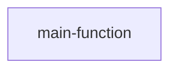
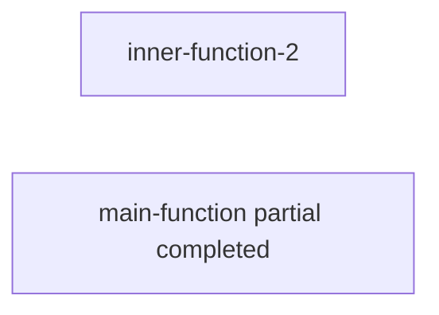
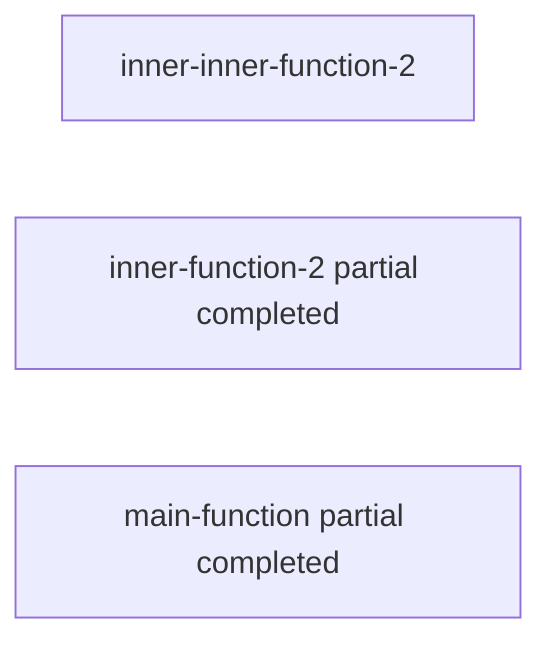
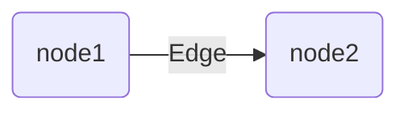

# How computer memory works:

- You ask it to store sth, and it'll tell which address it used to store that thing. 
- When running the program, like calling a function: 
  1. the computer allocate first a box of memory
  2. Then it saves the variables used for that function in allocated memory

# Common data structures

If you want to store multiple things, then we'll use an `array` or a `linked list`.

## Array

Using array to store multiple values means the items are stored **contiguously** ( right next to each other ).

It means when you want to add another item in the array, and if the next slot is already taken by sth else, you need to move **completely** to another place, where you can fit all the the items.

## Llinked-list

Items of linked-list are stored independantly in the memory, so they can be anywhere, just each item stores the **address of the next item**.

#### Comparing of those 2

- Linked list is much easier when adding new items ( O(1) vs O(n) of array ), as you only need to change the address reference of the previous item & add new one. Same for deleting an item.
- But for getting an item, the compelexity of array is O(1), whereas the linked-list is O(n)

So depending on how data is used, if your list is of more inserting than read, then it's better to use a linked list, but if you need lots of reading from the list, then array is a better choice.

And if you need both fast insert/delete & random read, you can design some specific data structure, like an array of linked-list 😌. (hash table)

> TODO: The implementation fo array in JS depends on the engine, but typically is implemented using hashmap... Check more about how array is handled in js


## Hash tables ( or hash maps )

Actually the array in js is implemented internally as a hashTable 😂. Just the key of the table is the index. It's a very efficient data-structure, as the average time for search/insert/delete are all O(1), and the worst case are all O(n).

So to creat a hashTable, 

- we need to have a **hash function**, where you give it a string, and it gives back a number, which need to be
  - **consistent** for the same string, and
  - **different** for different string inputs. 

In the simplest form, the returned number is the address where you store the information of an item. 

- then using that returned hash key, we combine it with an **array**, or just as we said, an array of linked-list 🤘.


> In JavaScript, `Object` is a special case of hash table, but don't keep track of the size of items, and it didn't prevent you from getting a key conflict. And `Map` is a correct implementation of hash table in js.

Comparing with array, hashTable is easier for **mapping** one value to another. ( That's why it's also called `map`... ). 

### Usage

- DNS resolution is a perfect example of mapping an url to an IP address.
- avoid duplicated entries: as you can `get` from hashTable to know if sth already exits, and avoid duplicated entries
- implementing the cache.

### Handle key collisions

If 2 keys are assigned the same slot, we call it a **collision**.

We can handle it by using linked-list: If multiple keys map to the same slot, we start a **linked-list** at that slot. But if the linked-list gets too big, it'll be really slow to search inside it. ( We *cannot* use an array as it requires sequential slots to be available to store )

So again it's very **important** to choose the hash function, to make the keys are mapped evenly all over the hashTable, and prevent the eventually linked-list to be too long.

### Avoid worst case

As the worst-case of hashTable is all O(n), and is slower than both array and linked-list, it's really important to avoid the key collision.

We have 2 focus:

- a low load factor : it's calculated by `(number of items)/(slots in table)` , notice hashTable is stored as array in memory, the *load factor* can never exceed 1 as it means there's no way for each item has its own slot. We can **resizing** the hashTable if we have too many items in a hashTable ( AKA the load factor is too high, EX: **higher than 0.7** ). Normally we can just create a new array that *doubles* the size of current table, and re-insert all items using the hash function.
- a good hash function: it can distribute the items evenly in the array, like a SHA function


## Stack

Stack is **last-in-first-out**. 

It's like a bucket 🪣 , the earlier you put sth in it, the later you get it out, as it's covered by the items put in after. It has 2 actions: **push & pop**.

It's useful as all the program you wrote will have a **call stack**. It's the stack who keeps their execution order so you don't mess it up.

### Usage

Stack is very important for **recursive calls**, as it will **pile the calls** of functions in stack, so the order is guaranteed. And we can always have *half completed* functions stacked there to **resume** later.

But of course if you stack too much calls in the call stack, you'll have a stack overflow 😂. Especially with recursive function calls. We have sth called *tail recursion*.

> TODO: did the js engine ( ex: V8 ) implement tail call optimization ?

**Example**:

Let's say we have a function

```javascript
function inner1(var1) {
  // Do sth inside inner 1
}

function inner2(var2) {
  // Do sth inside inner 2
  innerInner2(var2);
}

function innerInner2(var3) {
  // Do sth again
}

function main(mainVar) {
  // Do sth
  inner1('blabla');
  inner2('bbbbbbb');
}

main();
```


1. We call the main function, the stack looks like this:




2. After `Do sth`, we go to the inner1 function, the stack looks like this, it'll **pause** the main function, and execute the inner function 1


3. After inner 1 is finish executing, the main function continues, then the call stack looks like this:



4. Then we encounter another inner function inside, the stack now looks like this:



5. After this one is over, we go back to the inner function2


6. After inner 2 finished, we go back to the main function, and finish executing of the entire call.


## Queue

Queue is **first-in-first-out**. 

It's like a pipe, you put sth to one end, and get it from another end.

It has 2 actions: **enqueue & dequeue**.


## Graph

It's a abstarct data structure, which models a set of **connections**.

It consists of Nodes & Edges:



The nodes with direct connection are called *neighbors*, like the "node1" & "node2" in the above graph.