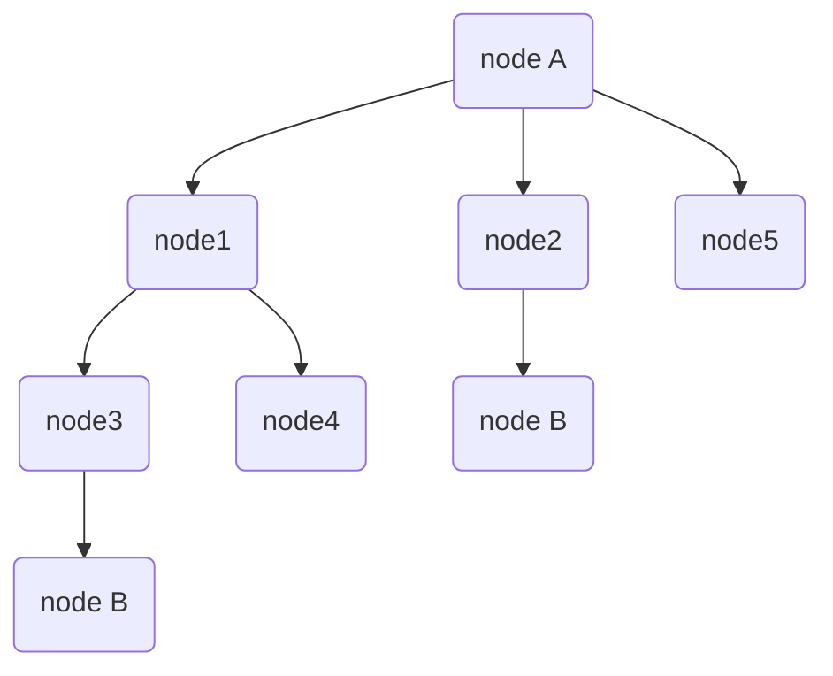

## Binary search

If we have a **sorted** list ( array in js ), instead of simple search start from beginning, it's much more efficient to use binary search, as each time you can rule out half of the remaining items.

```typescript
// input: array: [1,3,6,7,9,10], target: 10
// output: index of the target, which will be 5

// simple search would take O(n) steps
function simpleSearch(arr: number[], target: number): number {
  for (let i = 0; i < arr.length; i++) {
    if (arr[i] = target) {
      return i;
    }
  }
  return null;
}

// binary search would take O(log n) steps, we always talks about log2(n) actually
function binarySearch(arr: number[], target: number): number {
  let low = 0;
  let high = arr.length - 1;
  while (low <= high) {
    let mid = Math.floor((low + high) / 2);
    if (arr[mid] === target) {
      return mid;
    } else if (arr[mid] > target) {
      high = mid - 1;
    } else {
      low = mid + 1;
    }
  }
  return null;
}

// Binary search is also a D&C algo, let's rewrite it in recursion, which is almost the same idea as quickSort
function recBinarySearch(arr, target) {
  function search(inputArr, target, prevIndex) {
    if (inputArr.length === 1) {
      return inputArr[0] === target ? 0 + prevIndex : null;
    }
    const mid = Math.floor((inputArr.length - 1) / 2);
    if (inputArr[mid] === target) {
      return mid + prevIndex;
    }
    return inputArr[mid] > target ? search(inputArr.slice(0, mid), target, prevIndex) : search(inputArr.slice(mid + 1), target, mid + 1 + prevIndex)
  }
  return search(arr, target, 0);
}
```


## Breadth-First search

**This search algo is linked with [graph]('./data-structures.md#graph'). And to find the shorted distance between 2 things.**

Usage cases examples:

- find the fewest moves to win a checker game
- a spell checker to do fewest edits from misspelling to a correct word.
- find the cloest doctor 😌

Type of questions it can be used:

1. Is there a path from node A to node B ?
2. What is the shorted path from node A to node B ?

第一步先建立一个graph, 第二步建立一个queue

1. node A所有的neighbor nodes, 放在queue里，对于每一个neighbor node, 确认它是否是node B, 

2. 如果是， 我们就完成了

3. 如果不是，我们把这个node的所有neighbor nodes继续放到queue里（append them ) : to ensure the **shortest path**, we need a list, where we add first all the 1st degree connection, then the second degree connection, etc. As it's **first-in-first-out**, it's a [**queue**]('.data-structures.md#queue').. 

   重复以上步骤直到我们找到node B (或者找不到) 为止。

We call it "breadth-first", because it'll search first all the directly linked nodes ( 1st layer ), then the 2nd layer (neighbor nodes of neighor nodes ),,, and so on. So we're ensuring that we're using the fewest steps to reach the item.



For the above graph, if we want to reach node B from node A, we need 2 steps. From our algo (**N.B.** It's a directed graph):

1. we check first the neighbor nodes, which is `node1` & `node2` & `node5` (first degree connection)
2. and we didn't find node B, So we continue, and search the next level of breadth which contains `node3`, `node4` & `nodeB`. (second degree connection)

```javascript
// the graph as the above showed
const graph = new Map();
graph.set('nodeA', ['node1', 'node2', 'node5']);
graph.set('node1', ['node3', 'node4']);
graph.set('node2', ['nodeB']);
graph.set('node3', ['nodeB']);
graph.set('node5', []);

function bfs(inputGraph, start, end) {
  /* 注意这个queue是一个array of array, 里面的第二个item是用来accumulate需要累计的结果。
  此处为步数，但如下例我们也可以把它用作path的累计 */
  let queue = [[start, 0]];
  // to prevent the undirectional graph, that is, 2 items points to each other
  // 如果是一个directional graph，不会出现互相指向的状况，则这个checked check可以去掉
  const checked = new Set();
  while(queue.length) {
    const [node, step] = queue.shift();
    if ( node === end ) {
      return step;
    }
    if (inputGraph.has(node) && !checked.has(node)) {
      queue.push(...inputGraph.get(node).map(n => ([n, step + 1])))
    }
    checked.add(node);
  }
  return null;
}

console.log(bfs(graph, 'nodeA', 'nodeB')); // 2

// what if you need to output the path ? We need keep track of the path....
function bfsPath(inputGraph, start, end) {
  // setup the queue
  let queue = [[start, []]];
  while (queue.length) {
    // check the first item in queue
    const [node, path] = queue.shift();
    if (node === end) {
      path.push(node);
      return path;
    } 
    if (inputGraph.has(node)) {
      // push the previous path to each neighbor node
      const subPath = inputGraph.get(node).map(neighbor => ([neighbor, [...path, node]]));
      queue.push(...subPath);
    }
  }
  return 'not found';
}

console.log(bfsPath(graph, 'nodeA', 'nodeB')); // ['node2', 'nodeB']


```


Some side notes:

我之前优先用了recursive version来写bfs, 这个写法可以用array concat来整体计算同一level的node, 但需要输出具体路径的时候遇到了点困难。事实上recursive的写法更适合**Depth-first-search**(DFS)

```javascript
// same graph as the above showed
const graph = new Map();
graph.set('nodeA', ['node1', 'node2', 'node5']);
graph.set('node1', ['node3', 'node4']);
graph.set('node2', ['nodeB']);
graph.set('node3', ['nodeB']);
graph.set('node5', []);


// find the steps to go from nodeA to nodeB, note here we are concat the childNodes in the same level.
function bfs(inputGraph, start, end) {
  function searchForTarget(nodes, step) {
    if (!nodes || !nodes.length) {
      return null;
    }
    // setup a queue
  	let childNodes = [];
    for (let i = 0; i < nodes.length; i++) {
    	if (nodes[i] === end) {
      	return step + 1;
      } else {
        // this one did the trick
        childNodes = [...childNodes, ...(inputGraph.has(nodes[i]) ? inputGraph.get(nodes[i]) : [])];
      }
    }
    return searchForTarget(childNodes, step + 1);
  }
  return searchForTarget(inputGraph.get(start), 0);
}

// dfs -> 只需要在concat那一步直接循环下去即可，这样就会先搜索子树，而不是同一level的sibling
// nope it's not working !!!!!
function dfs(inputGraph, start, end) {
  // setup a stack
  let children = [];
  function searchForTarget(nodes, path) {
    if (!nodes || !nodes.length) {
      return null;
    }
    for (let i = 0; i < nodes.length; i++) {
    	if (nodes[i] === end) {
        // if you want to print the whole tree, instead of return just save it to an outer variable
      	return [...path, nodes[i]];
      } else {
        const childNodes = inputGraph.has(nodes[i]) ? inputGraph.get(nodes[i]) : [];
        if (childNodes.length) {
          return searchForTarget(childNodes, [...path, nodes[i]]);
        }
      }
    }
  }
  return searchForTarget(inputGraph.get(start), []);
}

```


